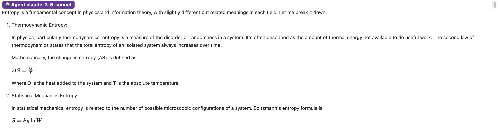

# 🍋😛 SUMMONy aka S6

Collection of tools and UIs for chatting and experimenting with multiple LLMs (via their APIs) at the same time.


## Features

- support for most top-tier and/or common LLM APIs:
  - OpenAI, Anthropic, Google Gemini, Ollama API, more to come
  - all under a common interface
  - (coming soon) supporting multimodal capabilities
- parallel streaming and display of outputs - to be able to read the results as fast as possible
- simple but powerful jupyter notebook code-first UI capable of:
  - re-asking the same question with different parameters
  - asking questions only to specific agents in a multi-agent conversation, aka tree-style/non-linear conversations
  - (to be improved) rendeing of LaTeX, html, code and diagrams in common formats in answers
- simple but powerful conversations (de)serialization format, capturing both the messages and the parameters useed at their generation, and able to avoid storing duplicated copies of the same message in the histories of multiple agents part of the conversation
- full api-calls logging (file based, structured - JSON): every request-response pair, every chunk in a stream response

## Install

```sh
pip install summony summony[openai] summony[anthropic] summony[google] summony[ollama]
```

## Usage / examples

### Prerequisites

- copy `.env.example` to `.env` (git ignored) and add in your API keys
- either install summony package or clone this repo and follow instructions under "Develop / run-from cloned repo" heading

### Jupyter Notebook UI

(See full example in ./example-1.v2.ipynb - rerun locally to see full ouputs as some parts are not rendered notebook previews)

```python
c = NBUI(
    models=[
        "claude-3-5-sonnet",  # model name "shortcuts" for anthropic too (eg. instead of "claude-3-5-sonnet-20240620" etc.)
        "o1-preview",  # reasoning models supported under same interface
        "gemini-1.5-pro-002",
    ],
    system_prompt="You are the sum of most of humanity's knowledge crystallized into a single entity: a helpful and thoughtful AI.",
    p_temperature={0: 0.6, 2: 0.8},  # params targetted to agents by index, eg. 0.6 for sonnet, 0.8 for gemini
)
await c("What is entropy?")  # async default to suport simultaneous display of parallel streaming responses
```


\[...]




```python
# ask follow-up question only to first agent (sonnet)
await c("What about quantum entropy?", to=[0])
```


```python
# re-generate answer for third agent (originally generated reply messagee is kept in conversation history too, but ignored for further request unless explicitly picked by setting its .chosen=True)
await c(to=[2])
```

```python
# next question targetting *all* agents in conversation
await c("Make me a very concise table with contexts and equations for entropy")
```

```python
# serializing conversation to JSON
from summony.agents.serialization import conversation_to_dict

conv_dict = conversation_to_dict(c.agents)
with open("./data/example-1-conv.json", "w") as f:
    f.write(json.dumps(conv_dict, indent=2, ensure_ascii=False))
print(json.dumps(conv_dict, indent=2, ensure_ascii=False))
```

```python
# read store conversation and boot it up in an UI
from summony.agents.serialization import conversation_from_dict

with open("./data/example-1-conv.json", "r") as f:
    conv_dict = json.loads(f.read())
restored_agents = conversation_from_dict(conv_dict)
restored_agents
c2 = NBUI(agents=restored_c_agents)

# (re)display conversation from agents histories
c2.show_conversation(short=80)
```

```python
# carry on a restored conversation as you'expect
await restored_c.ask("Display it as HTML instead")
```


## Develop / run-from cloned repo

### Using UV

NOTE: [uv](https://docs.astral.sh/uv/) is an awesome alterative to Pipenv, Poetry etc.

```sh
# create and activate python virtual environment
uv venv
source ./.venv/bin/activate

# install dependencies as recorded in uv.lock
uv sync --locked --all-extras

# create jupyter kernel for environment
uv run ipython kernel install --user --name=s6-uv

# run jupyter
uv run --with jupyter jupyter lab
```

### Using plain pip

```sh
# (optional, recommended) create and activate a Python 3.12+ environment
pip install -r ./requirements.txt
ipython kernel install --user --name=s6-uv  # create jupyter kernel for environment
jupyter notebook  # or: jupyter lab
```
